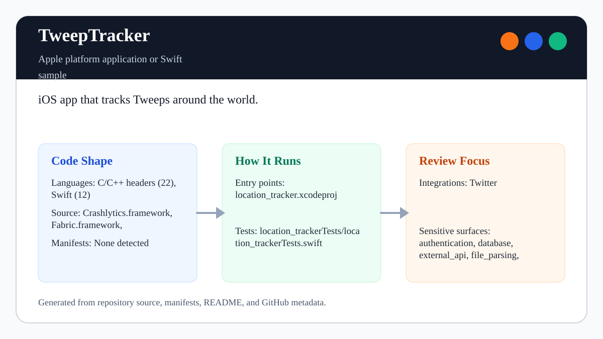
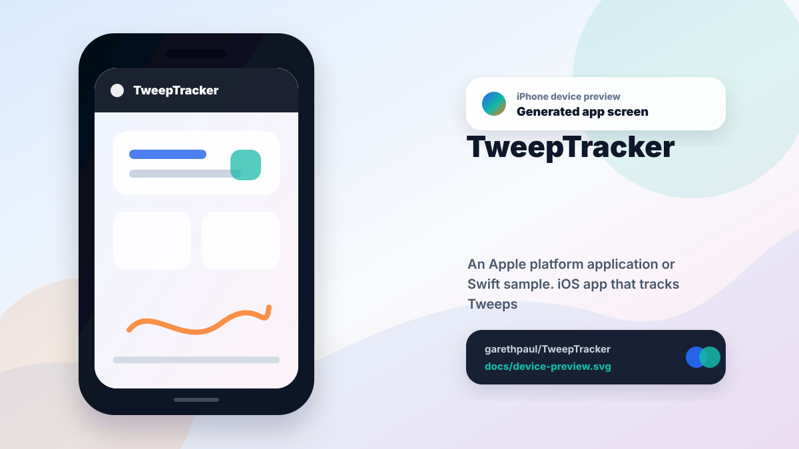

# TweepTracker

<!-- README-OVERVIEW-IMAGE -->


## Device Preview

<!-- DEVICE-PREVIEW-IMAGE -->


## Overview

`garethpaul/TweepTracker` is an Apple platform application or Swift sample. iOS app that tracks Tweeps around the world.

This README is based on the checked-in source, manifests, scripts, and repository metadata on the `master` branch. The project language mix found during review was: C/C++ headers (22), Swift (12).

## Repository Contents

- `README.md` - project overview and local usage notes
- `Crashlytics.framework` - source or example code
- `Fabric.framework` - source or example code
- `location_tracker` - source or example code
- `location_tracker.xcodeproj` - Xcode project file
- `location_trackerTests` - source or example code
- `SECURITY.md` - security reporting and disclosure guidance
- `TwitterKit.framework` - source or example code
- `VISION.md` - project direction and maintenance guardrails

Additional scan context:

- Source directories: Crashlytics.framework, Fabric.framework, TwitterKit.framework, location_tracker, location_trackerTests
- Dependency and build manifests: none detected
- Entry points or build surfaces: location_tracker.xcodeproj
- Test-looking files: location_trackerTests/location_trackerTests.swift

## Getting Started

### Prerequisites

- Git
- macOS with Xcode for building Apple platform projects

### Setup

```bash
git clone https://github.com/garethpaul/TweepTracker.git
cd TweepTracker
```

The setup commands above are derived from repository files. Legacy mobile, Python, or JavaScript samples may require older SDKs or package versions than a modern workstation uses by default.

## Running or Using the Project

- Open `location_tracker.xcodeproj` in Xcode, choose the app or sample scheme, and run it on the matching simulator/device.
- Run `make check` for static project and Twitter JSON guard checks. The Xcode
  test and build steps run only on hosts where `xcodebuild` is installed.

## Testing and Verification

- `make check` runs plist, storyboard, asset, Xcode project, Twitter JSON
  parsing, HTTPS-only bounded profile-image loading, map coordinate order, Twitter login
  navigation, non-blocking map reveal timing, and no external coordinate upload
  contract checks. Static checks also require Twitter list-member request
  failures, timeline coordinate lookup failures, and profile-image lookup
  failures to complete with empty results so the map setup path can finish.
  Timeline coordinate checks require latitude and longitude JSON values to be
  numeric before map annotations are created. Unused placemark and coordinate
  logging surfaces are also prohibited.
- Reused map annotation views clear stale avatars and only accept an async
  image when they still represent the requesting Tweep.
- Static checks also require completed canonical plans under `docs/plans`.
- GitHub Actions installs Python 3.12 and runs `make check` for all branch
  pushes, pull requests, and manual runs with read-only repository permissions,
  credential-free checkout, a five-minute timeout, a fixed Ubuntu 24.04 runner,
  and commit-pinned Node 24 actions. This validates static contracts only; it
  does not validate the retired vendored SDK binaries.
- Xcode's test action or `xcodebuild test` with the appropriate scheme and destination on macOS

When the required SDK or runtime is unavailable, use static checks and source review first, then verify on a machine that has the matching platform toolchain.

## Configuration and Secrets

- Detected references to Twitter. Keep API keys, OAuth credentials, tokens, and account-specific values in local configuration only.
- The checked-in app plist must not contain Twitter/Fabric consumer secrets or
  weaken App Transport Security. Profile-image requests and final responses
  are accepted only over HTTPS.
- Placemark fields and device coordinates must not be copied into diagnostic
  logs; map rendering continues to use guarded remote coordinate results.

## Security and Privacy Notes

- Review changes touching authentication or token handling; examples from the scan include Crashlytics.framework/Versions/A/Headers/Crashlytics.h, TwitterKit.framework/Versions/A/Headers/DGTAuthenticateButton.h, TwitterKit.framework/Versions/A/Headers/DGTSession.h, TwitterKit.framework/Versions/A/Headers/Digits.h, and 6 more.
- Review changes touching external API calls or credential-adjacent configuration; examples from the scan include Crashlytics.framework/Versions/A/Headers/Crashlytics.h, Fabric.framework/Versions/A/Headers/Fabric.h, TwitterKit.framework/Versions/A/Headers/DGTAuthenticateButton.h, TwitterKit.framework/Versions/A/Headers/DGTConstants.h, and 6 more.
- Review changes touching network requests, sockets, or service endpoints; examples from the scan include TwitterKit.framework/Versions/A/Headers/TWTRAPIClient.h, TwitterKit.framework/Versions/A/Headers/TWTRAPIErrorCode.h, TwitterKit.framework/Versions/A/Headers/TWTROAuthSigning.h, TwitterKit.framework/Versions/A/Headers/TWTRSession.h, and 5 more.
- Review changes touching mobile permissions or privacy-sensitive device data; examples from the scan include TwitterKit.framework/Versions/A/Headers/TWTRConstants.h, location_tracker/AppDelegate.swift, location_tracker/ViewController.swift.
- Review changes touching file, media, JSON, XML, CSV, OCR, or data parsing; examples from the scan include TwitterKit.framework/Versions/A/Headers/TWTRAPIClient.h, TwitterKit.framework/Versions/A/Headers/TWTRComposer.h, TwitterKit.framework/Versions/A/Headers/TWTROAuthSigning.h, TwitterKit.framework/Versions/A/Headers/TWTRTweet.h, and 6 more.
- Review changes touching database, model, or persistence code; examples from the scan include TwitterKit.framework/Versions/A/Headers/TWTRTweetTableViewCell.h, TwitterKit.framework/Versions/A/Headers/TWTRTweetViewDelegate.h.

## Maintenance Notes

- This looks like an Apple platform project or sample. Xcode, Swift, CocoaPods, and deployment target versions may need to match the original project era.
- See `SECURITY.md` for vulnerability reporting and safe research guidance.
- See `VISION.md` for project direction and contribution guardrails.
- See `docs/plans/2026-06-08-tweeptracker-baseline.md` for the canonical
  static project and Twitter JSON parsing baseline.
- See `docs/plans/2026-06-08-profile-image-guards.md` for profile image URL
  and decode guard coverage.
- See `docs/plans/2026-06-09-map-coordinate-order-guard.md` for timeline
  coordinate ordering and map annotation coverage.
- See `docs/plans/2026-06-09-remove-coordinate-upload-helper.md` for the
  no external coordinate upload guard.
- See `docs/plans/2026-06-09-login-session-guard.md` for the Twitter login
  navigation guard.
- See `docs/plans/2026-06-09-nonblocking-map-reveal.md` for the map reveal
  timing guard.
- See `docs/plans/2026-06-09-find-tweeps-error-completion.md` for the
  list-member request failure completion guard.
- See `docs/plans/2026-06-09-timeline-location-completion.md` for the timeline
  coordinate lookup completion guard.
- See `docs/plans/2026-06-09-profile-image-completion.md` for profile-image
  lookup completion coverage.
- See `docs/plans/2026-06-09-coordinate-number-validation.md` for numeric
  timeline coordinate validation.
- See `docs/plans/2026-06-10-ci-baseline.md` for the hosted GitHub Actions
  static contract gate.
- See `docs/plans/2026-06-10-profile-image-transport.md` for HTTPS, response,
  size, timeout, and queue boundaries on remote profile images.
- See `docs/plans/2026-06-13-profile-image-urlsession.md` for the session-based
  profile image transport migration.
- See `docs/plans/2026-06-10-annotation-image-reuse.md` for asynchronous map
  annotation image reuse guards.
- See `docs/plans/2026-06-12-location-log-privacy.md` for the removal of unused
  placemark and coordinate logging surfaces.

## Contributing

Keep changes small and tied to the project that is already present in this repository. For code changes, document the toolchain used, avoid committing generated dependency directories or local configuration, and update this README when setup or verification steps change.
